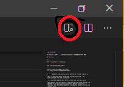

# server and permission,firewall(ubuntu),usercreate setting

コマンドの" "で囲まれた部分は各自の環境や設定で書き換えてください

vscodeで開いて画像のボタンを押すときれいに表示されます。



[top menuに戻る](../../readme.md)

## ssh設定

---

#### 設定ファイル場所と編集方法

```
sudo vim /etc/ssh/sshd_config
```

vimの部分はお好きなエディタに変更可能
~~(vim使えるようになるといいことあるかも)~~ ←宗教勧誘はおやめください

```sh
#       $OpenBSD: sshd_config,v 1.101 2017/03/14 07:19:07 djm Exp $                                               

# This is the sshd server system-wide configuration file.  See                                                    
# sshd_config(5) for more information.

# This sshd was compiled with PATH=/usr/bin:/bin:/usr/sbin:/sbin

# The strategy used for options in the default sshd_config shipped with
# OpenSSH is to specify options with their default value where
# possible, but leave them commented.  Uncommented options override the
# default value.

Port 22
```

上記は設定ファイルの一部です＃はコメントなので、先頭にコメントがついているものは非有効化されている項目です.


\#を外すことで設定が有効化されます。

>**※注意**
設定をコメントアウトしている場合,非有効化ではなくデフォルトの値が適用されている場合があります。正しい設定であることを確認してください。

上記の最下行はPort 22となっています、これはsshで接続するポートのことです。

標準の22番から1023以降の自分で決めた番号に変更することで被攻撃確率を下げることができます。

*注釈:0~1023はWelknownPort(予約済み番号)と呼ばれ自由に使用することができない。推奨値は49152\~65535*

```sh
Port 50000 #1024~65535から適当な数字
```

↑変更後

つづきの設定

```sh
Port 50000
#AddressFamily any
#ListenAddress 0.0.0.0
#ListenAddress ::

#HostKey /etc/ssh/ssh_host_rsa_key
#HostKey /etc/ssh/ssh_host_ecdsa_key
#HostKey /etc/ssh/ssh_host_ed25519_key

# Ciphers and keying
#RekeyLimit default none

# Logging
#SyslogFacility AUTH
#LogLevel INFO

# Authentication:

#LoginGraceTime 2m
#PermitRootLogin prohibit-password
#StrictModes yes
#MaxAuthTries 6
#MaxSessions 10

PubkeyAuthentication no
```

上記の最下行の設定Pubkey......は公開鍵によるサーバーアクセスをyes|noにする設定です。

基本的に鍵によるサーバアクセスが安全なのでここはキーの登録後yesに変更しましょう。

キー登録後↓

```sh
PubkeyAuthentication yes
```

つづきの設定

```sh
PubkeyAuthentication yes

# Expect .ssh/authorized_keys2 to be disregarded by default in future.
#AuthorizedKeysFile     .ssh/authorized_keys .ssh/authorized_keys2

#AuthorizedPrincipalsFile none

#AuthorizedKeysCommand none
#AuthorizedKeysCommandUser nobody

# For this to work you will also need host keys in /etc/ssh/ssh_known_hosts
#HostbasedAuthentication no
# Change to yes if you don't trust ~/.ssh/known_hosts for
# HostbasedAuthentication
#IgnoreUserKnownHosts no
# Don't read the user's ~/.rhosts and ~/.shosts files
#IgnoreRhosts yes

# To disable tunneled clear text passwords, change to no here!
PasswordAuthentication yes
```

上記のPassword.....はパスワードでサーバーにアクセスできるかできないかyes|noを設定します。

基本的にパスワード認証は危険なのでnoに変えましょう

```sh
PasswordAuthentication no
```

つづきの設定

```sh
PasswordAuthentication no
#PermitEmptyPasswords no

# Change to yes to enable challenge-response passwords (beware issues with
# some PAM modules and threads)
ChallengeResponseAuthentication yes
```

ChallengeResponseAuthenticationはPAM使わないひとにはあまり関係ないので、noにしましょうPAMって何って人もnoにしましょう。

PAMは話が長くなるので割愛します。

```sh
ChallengeResponseAuthentication no
```

```sh
ChallengeResponseAuthentication no

# Kerberos options
#KerberosAuthentication no
#KerberosOrLocalPasswd yes
#KerberosTicketCleanup yes
#KerberosGetAFSToken no

# GSSAPI options
#GSSAPIAuthentication no
#GSSAPICleanupCredentials yes
#GSSAPIStrictAcceptorCheck yes
#GSSAPIKeyExchange no

# Set this to 'yes' to enable PAM authentication, account processing,
# and session processing. If this is enabled, PAM authentication will
# be allowed through the ChallengeResponseAuthentication and
# PasswordAuthentication.  Depending on your PAM configuration,
# PAM authentication via ChallengeResponseAuthentication may bypass
# the setting of "PermitRootLogin without-password".
# If you just want the PAM account and session checks to run without
# PAM authentication, then enable this but set PasswordAuthentication
# and ChallengeResponseAuthentication to 'no'.
UsePAM yes
```

PAMは使わないのでnoにしましょう
```sh
UsePAM no
```

つづきの設定

```sh
UsePAM no

#AllowAgentForwarding yes
#AllowTcpForwarding yes
#GatewayPorts no
X11Forwarding yes
```
X11Forward.....はGUI画面転送に関する設定です、GUIの画面は使わないのでnoにしましょう。

```sh
X11Forwarding no
```

あとは基本的にデフォルト設定で大丈夫です。

ただ以下のコメントアウトが外れていると上手くいかないこともあるので適宜#をつけてコメントアウトしましょう。

```sh
# Kerberos options
#KerberosAuthentication no
#KerberosOrLocalPasswd yes
#KerberosTicketCleanup yes
#KerberosGetAFSToken no

# GSSAPI options
#GSSAPIAuthentication no
#GSSAPICleanupCredentials yes
#GSSAPIStrictAcceptorCheck yes
#GSSAPIKeyExchange no
```

### firewallにsshのポートを空ける

先ほどのsshd_configでPort番号を変えたのを覚えているでしょうか？
基本的にPortを変更した際や新たにサービスを外部に公開する際にはファイヤウォールの設定が必要です。

ここではinstallされているOSがubuntuとしてportの開け方を解説します。(ufw使用)

まずufwを有効化します。ufw（Uncomplicated FireWall）は、ファイアウォールの設定を行うコマンドです。
```sh
$ sudo ufw enable
```

開くポートを指定します

```sh
$ sudo ufw allow "自分が決めたポート番号"/tcp
```

設定をリロードしてポート開放します。

```sh
$ sudo ufw reload
```

これでポート開放することができました。

余談　portは全部閉じていてもvpnクライアントを通すことでsshやwebサービスを提供することができます、またポートノッキングによるポート開放も有効性は不明ですがポート隠匿することができます。

---

### 公開鍵登録

#### 登録場所

```sh
/home/"user名"/.ssh/authrized_keys
```

#### 登録方法（3種類）

方法1

```sh
$ cd /home/"user名"/.ssh
$ echo "公開鍵の中身" >> authorized_keys
```

方法2

公開鍵を転送後

```sh
$ cd /home/"user名"/.ssh
$ cat '公開鍵のパス' >> authorized_keys
```
方法3

ssh-copy-id (localでsshが使える場合、localでコマンド実行)

```sh
ssh-copy-id -i '公開鍵のパス' " ユーザ名"@"ホスト名"
```

#### 公開鍵の権限を変更する（パーミッション変更）

```sh
$ sudo chmod 600 authorized_keys
```

#### 設定をsshdサービスに読み込ませるために再起動

```sh
$ sudo systemctl restart sshd
```

#### おまけ（パーミッション）

パーミッション確認できるコマンド（一例）

```sh
$ ls -la
```


```sh
drwxr-xr-x 30 hoge staff  4096 May 13 08:48 certbot
```

上記から読むパーミッション（権限）
最初の一文字dはディレクトリ（フォルダ）を示します。
最初が-であればそれはファイルです。

残りのrwx-xrr-x 30 hoge staffの読み方

hoge staffはファイルやフォルダの所持者がhoge、グループはstaffということを表しています。


rwxr-xr-xの読み方、まず3つずつに分けます　rwx  r-x  r-x

(1) __rwx__ 

最初のrwxは所有者(ここではhoge)の権限がどうなっているか見ることができます。

r　はRReadable(読むことができる)こと示します。

w　はWritable(書き込みができる)ことを示します。

x　はeXecutable(実行可能等ができる)ことを示します。

'-' ハイフンは権限がなにも割り振られていないことを示します。

(2) __r-x__

ここではグループ(staff)所属者の権限がどうなってるか見ることができます。

r つまり読み込みはできます。

'-' ハイフンつまり所有者ではないグループメンバーには書き込み権限がないことを示します。

x グループメンバーに実行権限があることを示します。


(3) __r-x__

ここではその他の人の権限について書かれています。
上記と同じパーミッションなので読みと実行可能です。

ここでは説明を割愛します。


- 残りの数字の説明は長くなるので割愛します。

[パーミッションについてここで詳しく書いてあります。](../permission_num/permission_num.md)

---
 
# user作成

#### user作成

```
# useradd -m 'user名'
```

-m はuseraddコマンドのオプションで付けることによりユーザー作成だけではなくホームディレクトリ(/home/'user')も同時に作成される

#### user password変更

```
# passwd 'user名'
```

password入力の表示が出るので入力します。
passwordの確認が出るので同じものを入れます。

ちなみにCUIでは基本的にパスワードは表示されないので入力間違ったなと思ったらbackspace長押しして初めまで消して再入力しましょう。

#### userにsudoを使えるようにする

- sudoの軽い説明

    sudoとは一般ユーザーでもコマンド実行時にコマンドの前にsudoを付けることでそのコマンドに限りrootとして実行できます。

    一般的に常時rootでの活動は危険が伴いますので一般ユーザとして操作しましょう。

    また、コマンドを実行するのにroot権限が必要な場合sudoを使いましょう
    ちなみにroot権限,管理者権限という言葉はどちらも同じ意味です。

```
# visudo
```

下記を最終行に追記します

```
"自分で決めたユーザー名"   ALL=(ALL:ALL) ALL
```

設定が終わったらexitしてrootから一般ユーザーに戻ります。

```
# exit
$
```

これで設定したユーザーがsudoを使えるようになります

[top menuに戻る](../../readme.md)

